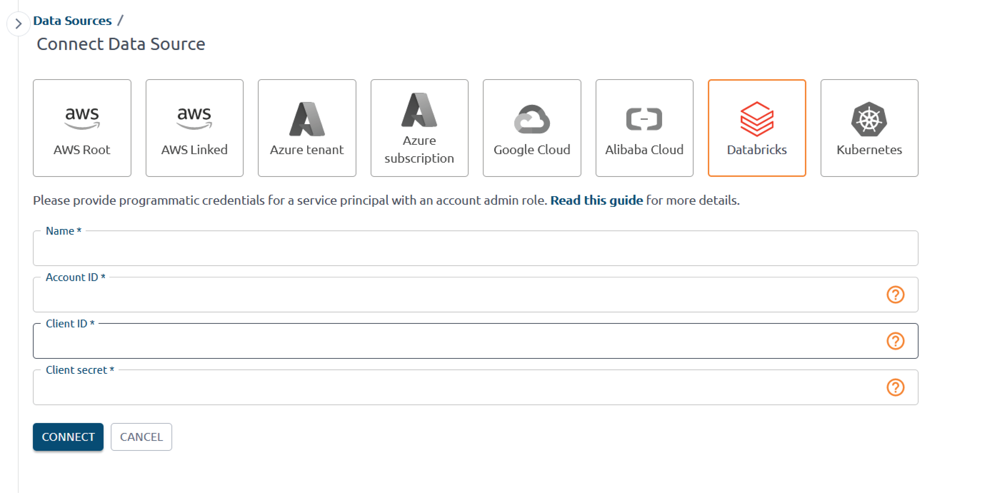
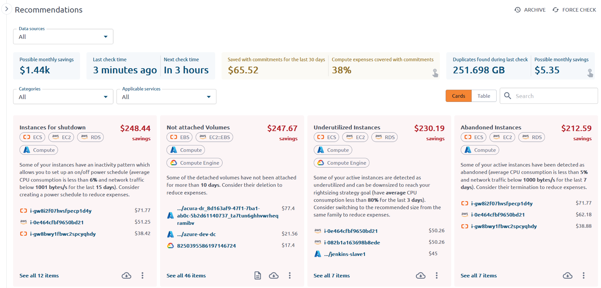
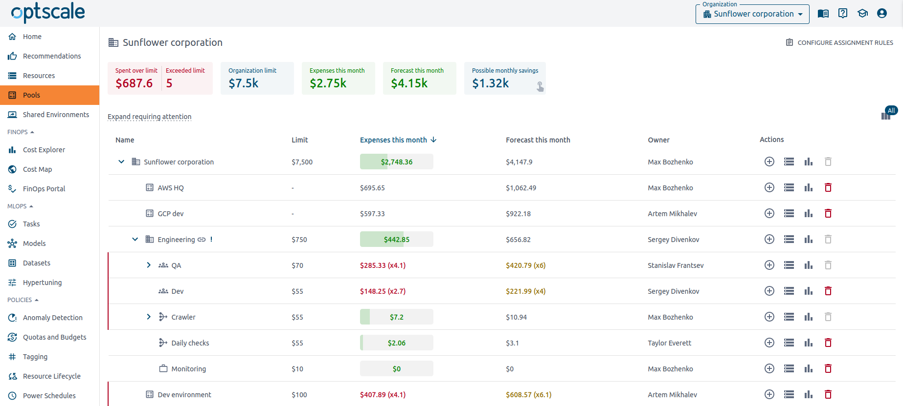
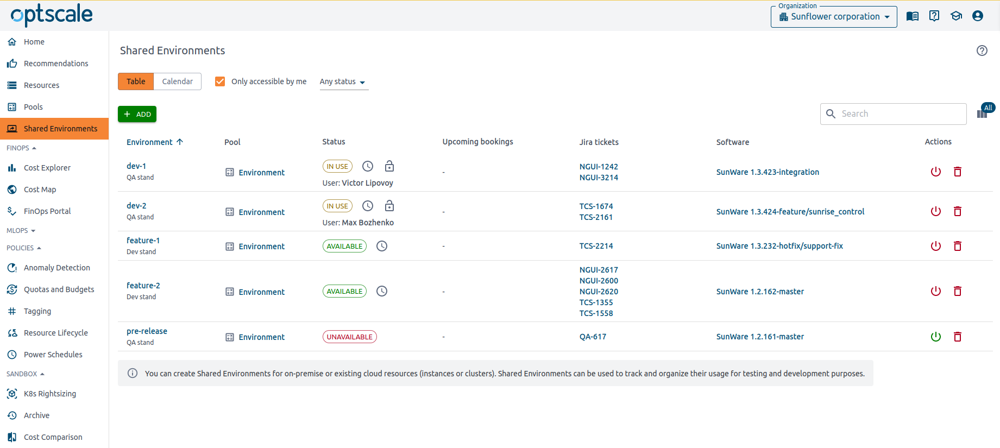
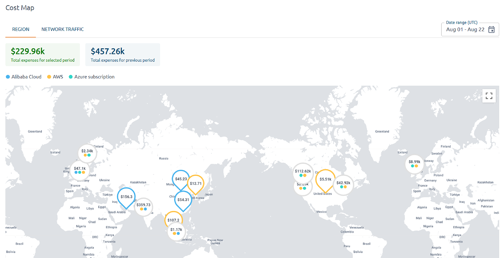
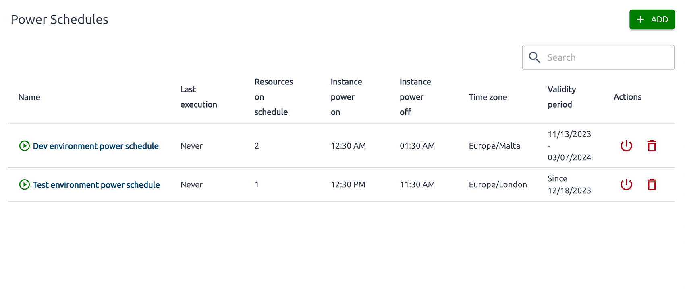
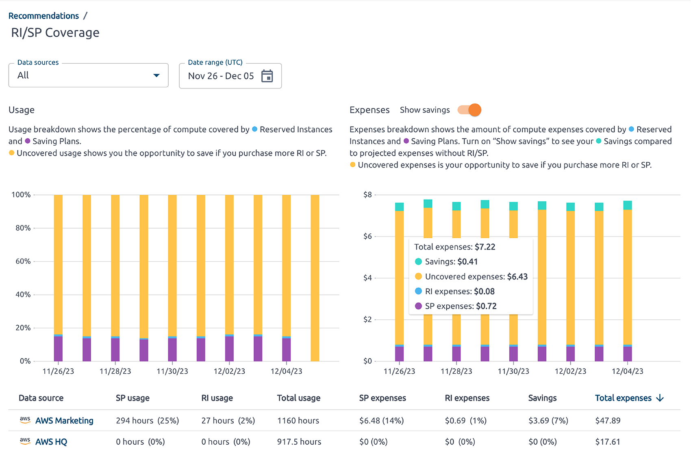
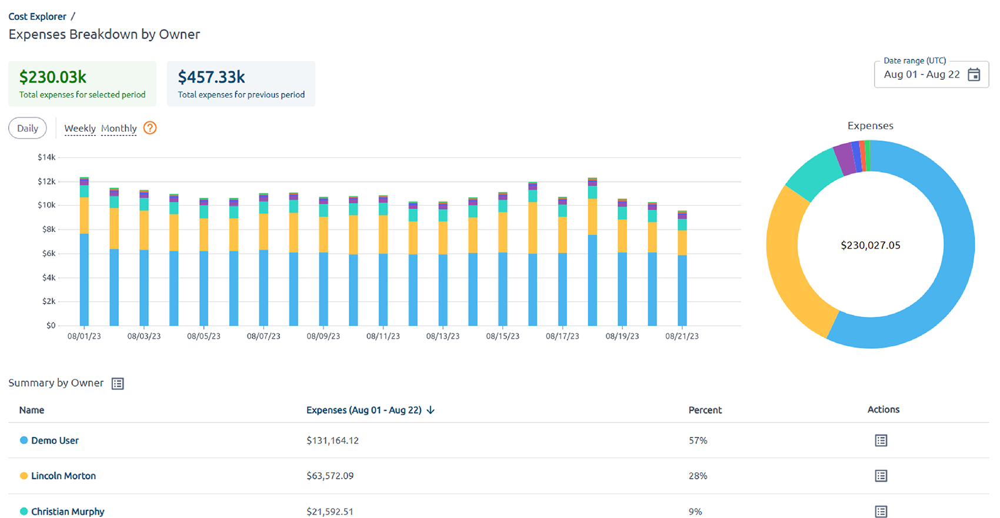
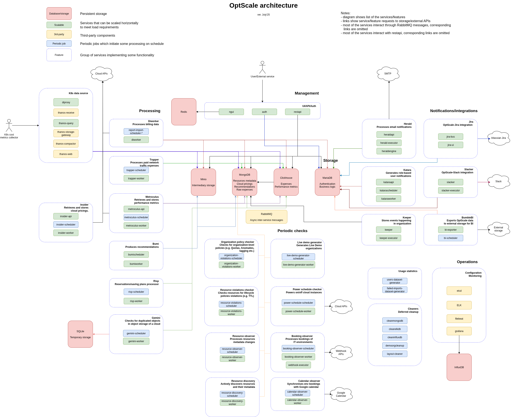

<p align="center">
⭐ Drop a star to support OptScale ⭐
</p>

# Open-Source FinOps & Cloud Cost Optimization Platform

<p align="center">
<a href="documentation/images/cover-GitHub.png"></a>
</p>

<br>OptScale is an open-source  [FinOps and cloud cost optimization platform](https://hystax.com/optscale/finops-overview/) that helps engineering and finance teams control and reduce spend across AWS, Microsoft Azure, GCP, Alibaba Cloud, and Kubernetes clusters.
It provides deep visibility into infrastructure costs, automated optimization recommendations, and governance tools for R&D and data platforms.

<br>
<br>
<p align="center">
<a href="https://my.optscale.com/live-demo?emailbypass=true&utm_source=github&utm_medium=readme"></a>
</p>
<br>
<div align="center">

[](https://www.python.org/)
[](https://opensource.org/licenses/Apache-2.0)


   


    


</div>

<br>

<div>
<br>  
  
  <i>
    “Hystax OptScale has been a game-changer for our FinOps practice. Its powerful capabilities, flexibility, and seamless integration have empowered us to deliver unprecedented transparency, control, and cost optimization for our clients. We truly value our partnership with Hystax and are excited to innovate further together.”
  </i>
  <div align="right">
    <i><b>Max Kuzkin</b>, General Manager, SoftwareOne Platform</i>
  </div>
</div>

<br>

<br>

## Overview
OptScale connects to your cloud accounts and Kubernetes clusters, ingests billing and usage data, and analyzes infrastructure consumption to surface actionable insights that eliminate waste and optimize resource usage.
It supports multi-cloud environments and integrates with popular data platforms, including Databricks, Amazon S3, and Amazon Redshift.

<br>

## Key Features
### Cost optimization
<li>Unused and idle resource detection for VMs, volumes, databases, and other cloud resources</li>
<li>Rightsizing recommendations for overprovisioned instances and workloads</li>
<li>R&D resource power management to automatically stop non-production environments outside working hours</li>
<li>Commitment utilization analysis for Reserved Instances, Savings Plans, and Spot Instances</li>


### FinOps and governance
<li>FinOps dashboards for engineering, finance, and product teams to track and allocate cloud spend</li>
<li>Budgeting and alerting for cost anomalies, spikes, and budget overruns</li>
<li>Tagging and ownership visibility to attribute costs to teams, projects, and environments</li>
<li>Policy-driven governance and automation controls</li>


### Data and AI/ML workloads
<li>Databricks cost analytics with detailed visibility into cluster usage and idle time</li>
<li>S3 and object storage optimization (lifecycle, unused buckets, storage class recommendations)</li>


### Kubernetes and multi‑cloud
<li>Kubernetes cluster cost allocation per namespace, workload, and label with workload-level visibility</li>
<li>Multi-cloud support for AWS, Microsoft Azure, Google Cloud, and Alibaba Cloud from a single OptScale instance</li>

<br><br>Learn more about [OptScale features for FinOps and multi-cloud cost management](https://hystax.com/optscale/finops-capabilities-and-benefits/).

<br>You can check OptScale [live demo](https://my.optscale.com/live-demo) to explore product features on a pre-generated demo organization.
<br>Learn more about the Hystax OptScale platform and its capabilities at [our website](https://hystax.com).


## Demos


|                    Databricks connection                       |                            Cost and performance recommendations               |
| :------------------------------------------------------------: | :---------------------------------------------------------------: |
|  |  |

|                            Pools of resources                               |                          Shared Environments                     |
| :-------------------------------------------------------------------------: | :--------------------------------------------------------------: |
|  |  |

|                       Cost geo map                        |                        VM Power Schedules                        |
| :-------------------------------------------------------: | :--------------------------------------------------------------: |
|  |  |

|            Reserved Instances and Savings Plans             |                         Cost breakdown by owner                         |
| :---------------------------------------------------------: | :---------------------------------------------------------------------: |
|  |  |

## OptScale components and architecture

<div align="center">
  
<br>
  <br>
</div>

## Getting started

The minimum hardware requirements for OptScale cluster: CPU: 8+ cores, RAM: 16Gb, SSD: 150+ Gb.

NVMe SSD is recommended.  

**OS Required**: [Ubuntu 24.04](https://releases.ubuntu.com/noble/).

_The current installation process should also work on Ubuntu 22.04_

#### Updating old installation
please follow [this document](documentation/update_to_24.04.md) to upgrade your existing installation on Ubuntu 20.04.


#### Installing required packages

Run the following commands:

```
sudo apt update; sudo apt install python3-pip sshpass git python3-virtualenv python3 python3-venv python3-dev -y
```

#### Pulling optscale-deploy scripts

Clone the repository

```markdown
git clone https://github.com/hystax/optscale.git
```

Change current directory:

```
cd optscale/optscale-deploy
```

#### Preparing virtual environment

Run the following commands:

```
virtualenv -p python3 .venv
source .venv/bin/activate
pip install -r requirements.txt
```

#### Kubernetes installation

Run the following command:
**comma after ip address is required**

```
ansible-playbook -e "ansible_ssh_user=<user>" -k -K -i "<ip address>," ansible/k8s-master.yaml
```

where `<user>` - actual username; `<ip address>` - host ip address,
ip address should be private address of the machine, you can check it with the command `ip a`.

**Note:** do not use `127.0.0.1` or `localhost` as the hostname. Instead, prefer providing the server's hostname (check with the command `hostname`) and make sure it is resolveable from host that the Ansible Playbooks ran from (if needed, add to the ``/etc/hosts`` files).

If your deployment server is the service-host server, add `-e "ansible_connection=local"` to the ansible command.

When ansible is completed, re-login, or simply run

```
source ~/.profile
```
to add local ~/bin path to the system $PATH variable

**Note:** you can build local images running

```
cd .. && ./build.sh --use-nerdctl
```
Images will build with version(tag) = local

#### Creating user overlay

Edit file with overlay - [optscale-deploy/overlay/user_template.yml](optscale-deploy/overlay/user_template.yml); see comments in overlay file for guidance.

Pay attention to "service_credentials" parameter, as OptScale uses it to retrieve cloud pricing data for recommendations calculation.

#### Cluster installation

Run the following command to start cluster from the required version:

```
./runkube.py --with-elk  -o overlay/user_template.yml -- <deployment name> <version>
```

or use `--no-pull` to start cluster from local images:

```
./runkube.py --with-elk --no-pull -o overlay/user_template.yml -- <deployment name> local
```

If you want to use socket:

```
./runkube.py --use-socket --with-elk  -o overlay/user_template.yml -- <deployment name> <version>

```

If you have insecure registry (with self-signed certificate) you can use --insecure flag with runkube.py:

```
./runkube.py --insecure --with-elk  -o overlay/user_template.yml -- <deployment name> <version>

```

**deployment name** must follow the RFC 1123: https://kubernetes.io/docs/concepts/overview/working-with-objects/names/

**version**:

- Use hystax/optscale git tag (eg: latest) if you use optscale public version.
- Use your own tag version if you build your optscale images (eg: local).

**please note**: if you use key authentication, you should have the required key (id_rsa) on the machine

Check the state of the pods using `kubectl get pods` command.
When all the pods are running your OptScale is ready to use. Try to access it by `https://<ip address>`.

#### Cluster update

Run the following command:

```
./runkube.py --with-elk  --update-only -- <deployment name>  <version>
```

#### Get IP access http(s):

```markdown
kubectl get services --field-selector metadata.name=ngingress-nginx-ingress-controller
```

#### Troubleshooting

In case of the following error:

When running  ```build.sh --use-nerdctl```:
```
FATA[0000] rootless containerd not running? (hint: use `containerd-rootless-setuptool.sh install` to start rootless containerd): stat /run/user/1000/containerd-rootless: no such file or directory 
Building image for trapper_worker, build tag: local
FATA[0000] rootless containerd not running? (hint: use `containerd-rootless-setuptool.sh install` to start rootless containerd): stat /run/user/1000/containerd-rootless: no such file or directory 
```
simply re-login or run ```source ~/.profile```

when running ```./runkube.py... <>```
```
python_on_whales.exceptions.DockerException: The command executed was `/usr/local/bin/nerdctl image inspect arcee:local`.
It returned with code 1
The content of stdout is ''
The content of stderr is 'time="2024-12-23T11:05:34Z" level=fatal msg="rootless containerd not running? (hint: use `containerd-rootless-setuptool.sh install` to start rootless containerd): stat /run/user/1000/containerd-rootless: no such file or directory"
```
the solution is also simply re-login or run ```source ~/.profile```


---


```
fatal: [172.22.24.157]: FAILED! => {"changed": true, "cmd": "kubeadm init --config /tmp/kubeadm-init.conf --upload-certs > kube_init.log", "delta": "0:00:00.936514", "end": "2022-11-30 09:42:18.304928", "msg": "non-zero return code", "rc": 1, "start": "2022-11-30 09:42:17.368414", "stderr": "W1130 09:42:17.461362  334184 validation.go:28] Cannot validate kube-proxy config - no validator is available\nW1130 09:42:17.461709  334184 validation.go:28] Cannot validate kubelet config - no validator is available\n\t[WARNING IsDockerSystemdCheck]: detected \"cgroupfs\" as the Docker cgroup driver. The recommended driver is \"systemd\". Please follow the guide at https://kubernetes.io/docs/setup/cri/\nerror execution phase preflight: [preflight] Some fatal errors occurred:\n\t[ERROR Port-6443]: Port 6443 is in use\n\t[ERROR Port-10259]: Port 10259 is in use\n\t[ERROR Port-10257]: Port 10257 is in use\n\t[ERROR FileAvailable--etc-kubernetes-manifests-kube-apiserver.yaml]: /etc/kubernetes/manifests/kube-apiserver.yaml already exists\n\t[ERROR FileAvailable--etc-kubernetes-manifests-kube-controller-manager.yaml]: /etc/kubernetes/manifests/kube-controller-manager.yaml already exists\n\t[ERROR FileAvailable--etc-kubernetes-manifests-kube-scheduler.yaml]: /etc/kubernetes/manifests/kube-scheduler.yaml already exists\n\t[ERROR FileAvailable--etc-kubernetes-manifests-etcd.yaml]: /etc/kubernetes/manifests/etcd.yaml already exists\n\t[ERROR Port-10250]: Port 10250 is in use\n\t[ERROR Port-2379]: Port 2379 is in use\n\t[ERROR Port-2380]: Port 2380 is in use\n\t[ERROR DirAvailable--var-lib-etcd]: /var/lib/etcd is not empty\n[preflight] If you know what you are doing, you can make a check non-fatal with `--ignore-preflight-errors=...`\nTo see the stack trace of this error execute with --v=5 or higher", "stderr_lines": ["W1130 09:42:17.461362  334184 validation.go:28] Cannot validate kube-proxy config - no validator is available", "W1130 09:42:17.461709  334184 validation.go:28] Cannot validate kubelet config - no validator is available", "\t[WARNING IsDockerSystemdCheck]: detected \"cgroupfs\" as the Docker cgroup driver. The recommended driver is \"systemd\". Please follow the guide at https://kubernetes.io/docs/setup/cri/", "error execution phase preflight: [preflight] Some fatal errors occurred:", "\t[ERROR Port-6443]: Port 6443 is in use", "\t[ERROR Port-10259]: Port 10259 is in use", "\t[ERROR Port-10257]: Port 10257 is in use", "\t[ERROR FileAvailable--etc-kubernetes-manifests-kube-apiserver.yaml]: /etc/kubernetes/manifests/kube-apiserver.yaml already exists", "\t[ERROR FileAvailable--etc-kubernetes-manifests-kube-controller-manager.yaml]: /etc/kubernetes/manifests/kube-controller-manager.yaml already exists", "\t[ERROR FileAvailable--etc-kubernetes-manifests-kube-scheduler.yaml]: /etc/kubernetes/manifests/kube-scheduler.yaml already exists", "\t[ERROR FileAvailable--etc-kubernetes-manifests-etcd.yaml]: /etc/kubernetes/manifests/etcd.yaml already exists", "\t[ERROR Port-10250]: Port 10250 is in use", "\t[ERROR Port-2379]: Port 2379 is in use", "\t[ERROR Port-2380]: Port 2380 is in use", "\t[ERROR DirAvailable--var-lib-etcd]: /var/lib/etcd is not empty", "[preflight] If you know what you are doing, you can make a check non-fatal with `--ignore-preflight-errors=...`", "To see the stack trace of this error execute with --v=5 or higher"], "stdout": "", "stdout_lines": []}
```

run the following command to reset k8s and retry the installation command:

```
sudo kubeadm reset -f
ansible-playbook -e "ansible_ssh_user=<user>" -k -K -i "<ip address>," ansible/k8s-master.yaml
```
---

in case of no connection on 443 port:

1. check ingress controller status
```
$ kubectl get pod | grep ingress
```
```
ngingress-nginx-ingress-controller-default-backend-78ccb699zp2z   1/1     Running           1 (8d ago)   18d
ngingress-nginx-ingress-controller-xdlp4                          1/1     Running           1 (8d ago)   18d
```
if ngingress-nginx-ingress-controller-xxxxx in the **CrashLoopBackoff** state or service in **0/1** please do following:

1. edit ngingress-nginx-ingress-controller daemonset
```
$ kubectl edit daemonset ngingress-nginx-ingress-controller
```
2. search for limits section

```
resources:
  limits:
    memory: 384Mi
  requests:
    memory: 192Mi
```
3. try to increase the limits and save the configmap, pods will automatically restarted

## Documentation

Read the [full OptScale documentation](https://hystax.com/documentation/optscale/) 📖

## Contributing

Please read and accept our [Contribution Agreement](CONTRIBUTING.md) before submitting pull requests.

## Community

Hystax drives FinOps methodology and has crafted a community of FinOps-related people. The community discusses FinOps & cloud cost management best practices; our experts offer users how-tos and technical recommendations and provide ongoing details and updates regarding the open-source OptScale solution.

You can check it out on [FinOps in practice website](https://finopsinpractice.org/)

## Contacts

Feel free to reach out to us with questions, feedback, or ideas at info@hystax.com.
You can check out the latest news from Hystax at:

- [LinkedIn](https://www.linkedin.com/company/hystax)
- [Twitter](https://twitter.com/hystaxcom)
- [Facebook](https://www.facebook.com/hystax)
- [YouTube](https://www.youtube.com/channel/UCP12kM-jeS2yMglN_dT44lA)
